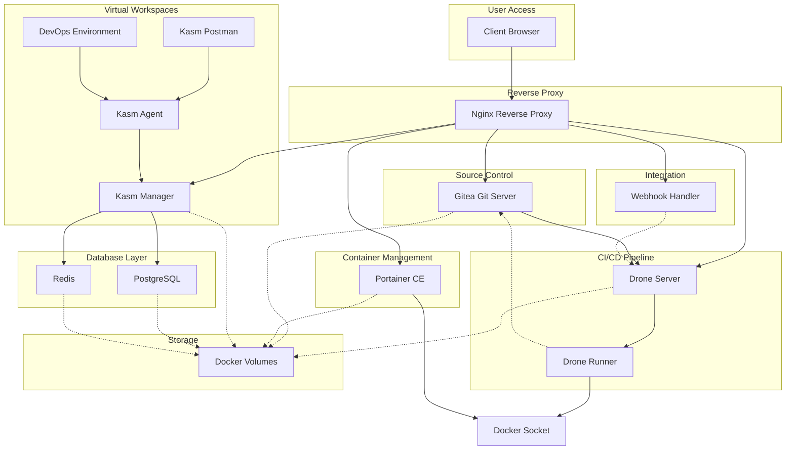

# RTPI-MalDev

A MalDev CI/CD Flavor of the Red Team Portable Infrastructure (RTPI-MalDev)

## DevOps Stack

A comprehensive, self-hosted DevOps environment with integrated source control, CI/CD, container management, and virtual workspaces.



## Features

- **Gitea**: Self-hosted Git server
- **Drone CI/CD**: Continuous integration and delivery platform
- **Portainer**: Container management UI
- **Kasm Workspaces**: Browser-based containerized applications
- **Nginx**: Reverse proxy for unified access

## Quick Start

1. Clone the repository:
   ```bash
   git clone https://github.com/yourusername/devops-stack.git
   cd devops-stack
   ```

2. Run the setup script:
   ```bash
   chmod +x scripts/setup.sh
   ./scripts/setup.sh
   ```

3. Customize the `.env` file with your settings

4. Start the services:
   ```bash
   docker-compose up -d
   ```

5. Get the Kasm API key:
   ```bash
   docker logs kasm_manager | grep "API KEY"
   ```

6. Update the `.env` file with the API key and restart:
   ```bash
   docker-compose restart kasm_agent
   ```

7. Access your services through a web browser:
   - Gitea: http://gitea.devops.local or http://your-server-ip:3000
   - Drone: http://drone.devops.local
   - Portainer: http://portainer.devops.local
   - Kasm: http://kasm.devops.local

## Prerequisites

- Docker Engine 20.10+
- Docker Compose 2.0+
- 4GB RAM minimum (8GB+ recommended)
- 20GB disk space minimum
- Linux OS (tested on Ubuntu 20.04+)

## Directory Structure

```
devops-stack/
├── docker-compose.yml    # Main composition file
├── .env                  # Environment variables
├── scripts/              # Helper scripts
├── config/               # Configuration files
├── custom/               # Custom Dockerfiles & code
└── docs/                 # Documentation
```

## Configuration

Edit the `.env` file to customize:
- Domain names
- Admin usernames and passwords
- Secret keys
- SSL/TLS settings

## Helper Scripts

- `scripts/setup.sh`: Initial setup
- `scripts/backup.sh`: Create backups
- `scripts/restore.sh`: Restore from backups
- `scripts/update.sh`: Update containers
- `scripts/monitor.sh`: Monitor resources

## Documentation

Refer to the `docs/` directory for detailed documentation:
- `docs/setup-instructions.md`: Detailed setup guide
- `docs/architecture-diagram.md`: System architecture
- `docs/project-summary.md`: Project overview

## Custom Components

The stack includes:
- Custom Kasm development environment
- Webhook handler for integrations

## Security Considerations

- Change all default passwords
- Enable HTTPS with valid SSL certificates
- Restrict access using firewall rules
- Regularly update all containers
- Schedule automatic backups

## License

This project is released under the MIT License.

## Contributing

Contributions are welcome! Please feel free to submit a Pull Request.
